# Documentação Técnica: Projeto AnaSoil

Este documento descreve a arquitetura e os fluxos de comportamento do sistema **AnaSoil**, utilizando a notação UML via Mermaid.js. A documentação segue as diretrizes do **RUP (Rational Unified Process)** e adota o padrão de design **EBC (Entity-Boundary-Control)**.

---

## 1. Diagrama de Classes (Modelo de Projeto)

Este diagrama representa a estrutura estática do sistema, dividida em camadas de Fronteira (Boundary), Controle (Control), Entidade (Entity) e Serviços de integração. O modelo reflete a implementação **RBAC (Role-Based Access Control)** conforme o código-fonte atual.

```mermaid
classDiagram
    %% ========== MOBILE BOUNDARY ==========
    class LoginPage {
        <<Boundary>>
        +build(BuildContext context)
    }
    class ResetPasswordPage {
        <<Boundary>>
        +build(BuildContext context)
    }
    class SplashPage {
        <<Boundary>>
        +build(BuildContext context)
    }
    class HomePage {
        <<Boundary>>
        +build(BuildContext context)
    }
    class HistoryPage {
        <<Boundary>>
        +build(BuildContext context)
    }
    class AnalysisPage {
        <<Boundary>>
        +build(BuildContext context)
    }
    class AnalysisDetailPage {
        <<Boundary>>
        +build(BuildContext context)
    }
    class ProfilePage {
        <<Boundary>>
        +build(BuildContext context)
    }
    class EditProfilePage {
        <<Boundary>>
        +build(BuildContext context)
    }
    class ChangePasswordPage {
        <<Boundary>>
        +build(BuildContext context)
    }
    class FarmersListPage {
        <<Boundary>>
        +build(BuildContext context)
    }
    class FarmerAnalysesPage {
        <<Boundary>>
        +build(BuildContext context)
    }
    class DocumentsPage {
        <<Boundary>>
        +build(BuildContext context)
    }
    class PdfPreviewPage {
        <<Boundary>>
        +build(BuildContext context)
    }

    %% ========== MOBILE CONTROL ==========
    class AuthViewModel {
        <<Control>>
        +login(LoginCredentials)
        +logout()
        +resetPassword(String)
        +loadCurrentUser()
    }
    class AnalysisViewModel {
        <<Control>>
        +uploadDocumentCommand
        +extractPdfCommand
        +saveAllExtractedAnalyses()
        +loadAnalysesCommand
    }
    class UploadFlow {
        <<Control>>
        +upload(File)
        +extract(File)
        +saveAll()
        +intakeState
    }
    class ProfileViewModel {
        <<Control>>
        +loadProfileCommand
        +updateProfileCommand
        +changePasswordCommand
    }
    class FarmersViewModel {
        <<Control>>
        +loadFarmers(String)
        +loadFarmerAnalyses(String)
        +loadAllFarmersAnalyses(String)
    }

    %% ========== MOBILE SERVICES / REPOSITORIES ==========
    class AuthRepository {
        <<Interface>>
        +login(LoginCredentials) Result~User~
        +logout() Result~void~
        +resetPassword(String) Result~void~
        +loadCurrentUser() Result~User?~
    }
    class ProfileRepository {
        <<Interface>>
        +getProfile() Result~UserProfile~
        +updateProfile(ProfileUpdateData) Result~void~
        +changePassword(PasswordUpdateData) Result~void~
    }
    class DocumentRepository {
        <<Interface>>
        +uploadDocument(File, String) Result~SoilDocument~
        +getDocuments() Result~List~
        +deleteDocument(String) Result~void~
    }
    class SoilAnalysisRepository {
        <<Interface>>
        +extractFromPdf(File) Result~List~
        +saveAnalysis(SoilAnalysis) Result~SoilAnalysis~
        +getAnalyses() Result~List~
        +deleteAnalysis(String) Result~void~
    }

    %% ========== MOBILE ENTITIES ==========
    class User {
        <<Entity>>
        +String id
        +String name
        +String email
        +ProfileType profileType
        +String? phone
        +String? avatarUrl
    }
    class SoilDocument {
        <<Entity>>
        +String id
        +String userId
        +String fileName
        +String fileUrl
        +DateTime createdAt
        +bool active
    }
    class SoilAnalysis {
        <<Entity>>
        +String id
        +String labNumber
        +String propertyName
        +DateTime analysisDate
        +double? organicMatter
        +double? phCacl2
        +double? al3Plus, ca2Plus, mg2Plus, kPlus
        +double? ctcEfetiva, ctcPh7
        +double? vPercent, pst, mPercent
        +bool active
    }
    class AnalysisIntakeState {
        <<Entity>>
        +AnalysisIntakeStep step
        +String? fileName
        +String? documentId
        +int extractedCount
    }
    class ProfileType {
        <<enumeration>>
        farmer
        consultant
        admin
    }

    %% ========== ADMIN BOUNDARY ==========
    class AdminLoginPage {
        <<Boundary>>
        +build(BuildContext context)
    }
    class UserListPage {
        <<Boundary>>
        +build(BuildContext context)
    }
    class UserFormPage {
        <<Boundary>>
        +build(BuildContext context)
    }
    class UserRelationPage {
        <<Boundary>>
        +build(BuildContext context)
    }
    class AdminAnalysisListPage {
        <<Boundary>>
        +build(BuildContext context)
    }
    class AdminAnalysisDetailPage {
        <<Boundary>>
        +build(BuildContext context)
    }
    class AdminDocumentListPage {
        <<Boundary>>
        +build(BuildContext context)
    }
    class AdminDocumentDetailPage {
        <<Boundary>>
        +build(BuildContext context)
    }

    %% ========== ADMIN CONTROL ==========
    class UserListViewModel {
        <<Control>>
        +fetchUsersCommand
        +deleteUserCommand
        +updateUserStatusCommand
    }
    class UserFormViewModel {
        <<Control>>
        +createUser(String, String, String)
        +updateUser(String, UserModel)
    }
    class UserRelationViewModel {
        <<Control>>
        +linkFarmerToConsultant(String, String)
        +unlinkFarmerFromConsultant(String, String)
    }
    class AdminAnalysisListViewModel {
        <<Control>>
        +fetchAnalysesCommand
        +deleteAnalysisCommand
    }
    class AdminDocumentListViewModel {
        <<Control>>
        +fetchDocumentsCommand
        +deleteDocumentCommand
    }

    %% ========== ADMIN SERVICES / REPOSITORIES ==========
    class AdminSession {
        <<Service>>
        +isAuthenticated
        +email
        +signOut()
    }
    class AuthService {
        <<Service>>
        +signIn(String, String)
        +signOut()
        +createAuthUser(String)
    }
    class FirestoreService {
        <<Service>>
        +getUsers() Stream~List~
        +getDocuments() Stream~List~
        +getAnalyses() Stream~List~
        +addUser(String, UserModel)
        +linkFarmerToConsultant(String, String)
        +unlinkFarmerFromConsultant(String, String)
    }
    class UserRepository {
        <<Repository>>
        +getUsers() Future~List~
        +deleteUser(String)
        +updateUserStatus(String, bool)
    }
    class AnalysisRepository {
        <<Repository>>
        +getAnalyses() Future~List~
        +getById(String) Future~SoilAnalysisModel?~
        +deleteAnalysis(String)
    }
    class DocumentRepository_Admin {
        <<Repository>>
        +getDocuments() Future~List~
        +getById(String) Future~DocumentModel?~
        +deleteDocument(String)
    }

    %% ========== SHARED ==========
    class ParameterClassifier {
        <<Shared>>
        +classifyAll(AnalysisParameterValues) List~ParameterClassification~
    }
    class ParameterClassification {
        <<Shared>>
        +String label
        +double value
        +ClassificationLevel level
        +double lowThreshold
        +double highThreshold
    }
    class ClassificationLevel {
        <<enumeration>>
        low
        medium
        high
    }

    %% ========== MOBILE RELATIONS ==========
    LoginPage --> AuthViewModel : aciona
    ResetPasswordPage --> AuthViewModel : aciona
    SplashPage --> AuthViewModel : aciona
    HomePage --> AuthViewModel : aciona
    HomePage --> ProfileViewModel : aciona
    HistoryPage --> AnalysisViewModel : aciona
    AnalysisPage --> AnalysisViewModel : aciona
    AnalysisDetailPage --> SoilAnalysis : exibe
    ProfilePage --> ProfileViewModel : aciona
    EditProfilePage --> ProfileViewModel : aciona
    ChangePasswordPage --> ProfileViewModel : aciona
    FarmersListPage --> FarmersViewModel : aciona
    FarmerAnalysesPage --> FarmersViewModel : aciona
    DocumentsPage --> AnalysisViewModel : aciona
    PdfPreviewPage --> SoilDocument : exibe

    AuthViewModel --> AuthRepository : delega
    ProfileViewModel --> ProfileRepository : delega
    AnalysisViewModel --> UploadFlow : delega
    AnalysisViewModel --> DocumentRepository : delega
    AnalysisViewModel --> SoilAnalysisRepository : delega
    UploadFlow --> DocumentRepository : delega
    UploadFlow --> SoilAnalysisRepository : delega
    FarmersViewModel --> FirestoreService : delega

    AuthRepository ..> User : manipula
    ProfileRepository ..> User : manipula
    DocumentRepository ..> SoilDocument : manipula
    SoilAnalysisRepository ..> SoilAnalysis : manipula
    UploadFlow ..> AnalysisIntakeState : gerencia
    UploadFlow ..> SoilAnalysis : manipula

    User --> ProfileType : possui
    SoilAnalysis --> ParameterClassifier : classifica
    ParameterClassifier --> ParameterClassification : produz
    ParameterClassification --> ClassificationLevel : contém

    %% ========== ADMIN RELATIONS ==========
    AdminLoginPage --> AuthService : aciona
    UserListPage --> UserListViewModel : aciona
    UserFormPage --> UserFormViewModel : aciona
    UserRelationPage --> UserRelationViewModel : aciona
    AdminAnalysisListPage --> AdminAnalysisListViewModel : aciona
    AdminAnalysisDetailPage --> AnalysisRepository : consulta
    AdminDocumentListPage --> AdminDocumentListViewModel : aciona
    AdminDocumentDetailPage --> DocumentRepository_Admin : consulta

    UserListViewModel --> UserRepository : delega
    UserFormViewModel --> AuthService : delega
    UserFormViewModel --> FirestoreService : delega
    UserRelationViewModel --> FirestoreService : delega
    AdminAnalysisListViewModel --> AnalysisRepository : delega
    AdminDocumentListViewModel --> DocumentRepository_Admin : delega

    AdminSession --> AuthService : encapsula
    UserListPage --> AdminSession : consulta
```

---

## 2. Diagramas de Sequência (Casos de Uso)

### UC01: Importar Documento

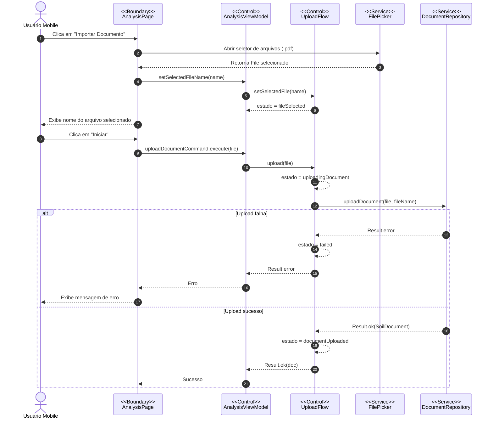

### UC02: Extrair e Salvar Análises

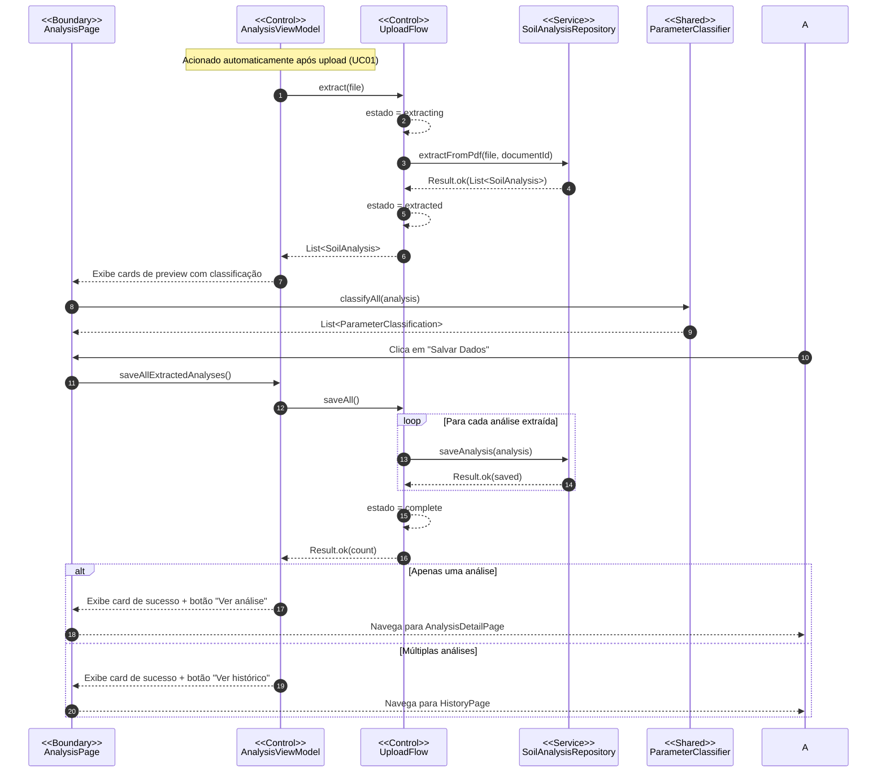

### UC03: Consultar Histórico de Análises

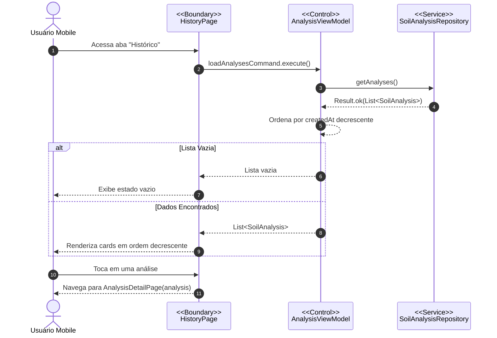

### UC04: Gerenciar Relações (Administrador)

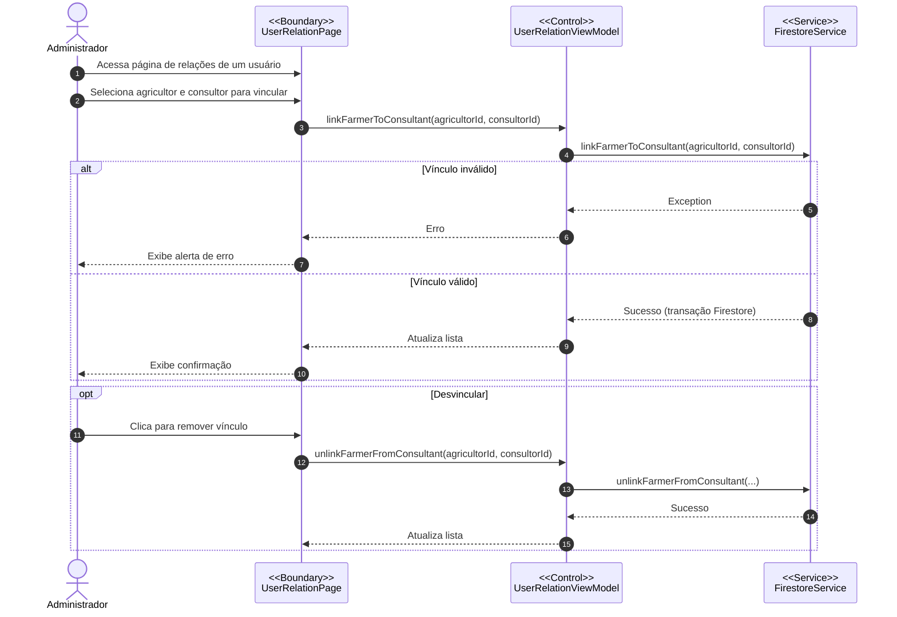

### UC05: Gerenciar Perfil (Mobile)

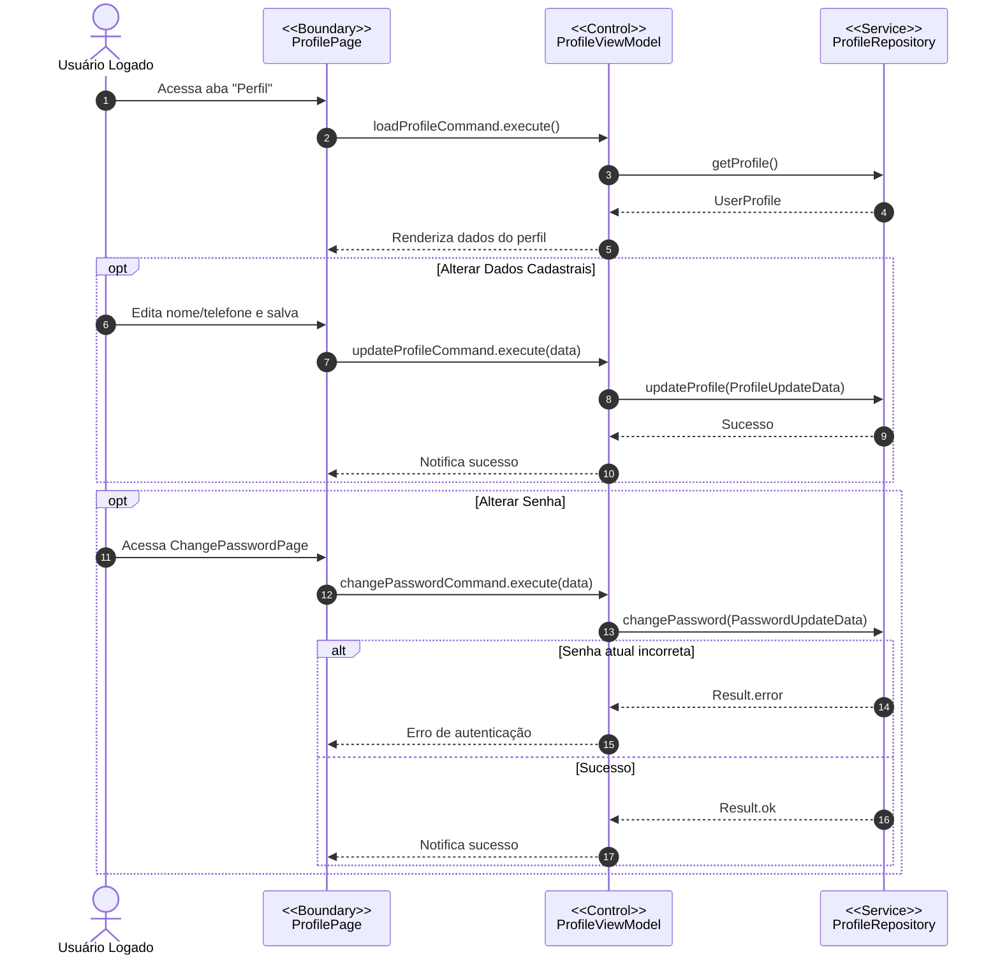

### UC06: Gerenciar Usuários (Administrador)

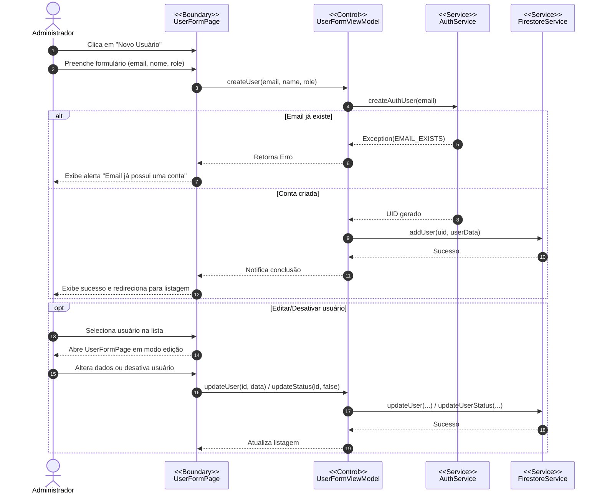

---

## 3. Arquitetura de Camadas

```
┌─────────────────────────────────────────────────────┐
│                    UI (Boundary)                     │
│  mobile: ui/auth, ui/home, ui/profile, ui/farmers   │
│  admin:  features/*/pages, shared/widgets           │
├─────────────────────────────────────────────────────┤
│                 Control (ViewModels)                 │
│  mobile: ui/*/   *_viewmodel.dart                   │
│          domain/  upload_flow.dart                  │
│  admin:  features/*/viewmodels/                     │
├─────────────────────────────────────────────────────┤
│            Services & Repositories (Adapter)         │
│  mobile: data/repositories/  (interfaces)           │
│          data/repositories/*_remote.dart (impl)     │
│          data/services/       (Firebase adapters)    │
│  admin:  core/repositories/   (concrete repos)      │
│          core/services/       (Firebase adapters)    │
├─────────────────────────────────────────────────────┤
│                 Domain (Entity)                      │
│  mobile: domain/models/                             │
│  admin:  core/models/                               │
│  shared: packages/anasoil_shared/lib/src/           │
│          (ParameterClassifier, FirestoreSchema,     │
│           Command, Result, ThemeTokens)              │
└─────────────────────────────────────────────────────┘
```

---

## 4. Diagrama de Caso de Uso

O AnaSoil possui três atores e dezesseis casos de uso distribuídos
entre o aplicativo móvel e a plataforma web administrativa.

```mermaid
graph TD
    A1((Agricultor))
    A2((Consultor))
    A3((Administrador))

    subgraph "Aplicativo Móvel"
        UC01["Autenticar usuário"]
        UC02["Recuperar senha"]
        UC03["Gerenciar perfil"]
        UC04["Importar documento PDF"]
        UC05["Gerar análise de solo"]
        UC06["Consultar histórico"]
        UC07["Visualizar detalhes da análise"]
        UC08["Gerenciar documentos"]
        UC09["Consultar agricultores vinculados"]
    end

    subgraph "Plataforma Web Administrativa"
        UC10["Autenticar administrador"]
        UC11["Gerenciar usuários"]
        UC12["Vincular agricultor e consultor"]
        UC13["Consultar documentos"]
        UC14["Consultar análises"]
        UC15["Remover documentos"]
        UC16["Remover análises"]
    end

    A1 --> UC01
    A1 --> UC02
    A1 --> UC03
    A1 --> UC04
    A1 --> UC05
    A1 --> UC06
    A1 --> UC07
    A1 --> UC08

    A2 --> UC01
    A2 --> UC02
    A2 --> UC03
    A2 --> UC04
    A2 --> UC05
    A2 --> UC06
    A2 --> UC07
    A2 --> UC08
    A2 --> UC09

    A3 --> UC10
    A3 --> UC11
    A3 --> UC12
    A3 --> UC13
    A3 --> UC14
    A3 --> UC15
    A3 --> UC16
```

---

## 5. Diagrama de Componentes

O sistema é composto por clientes Flutter e serviços Firebase. O pacote
compartilhado `anasoil_shared` provê contratos de domínio para ambas as
aplicações.

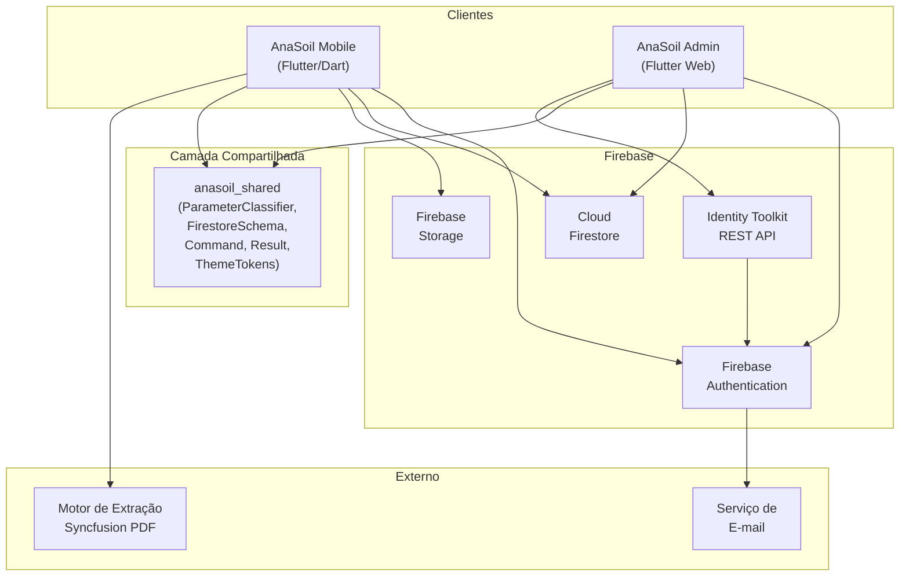

---

## 6. Diagrama de Implantação

O AnaSoil é implantado em dispositivos Android, navegadores web e serviços
Firebase hospedados na Google Cloud Platform.

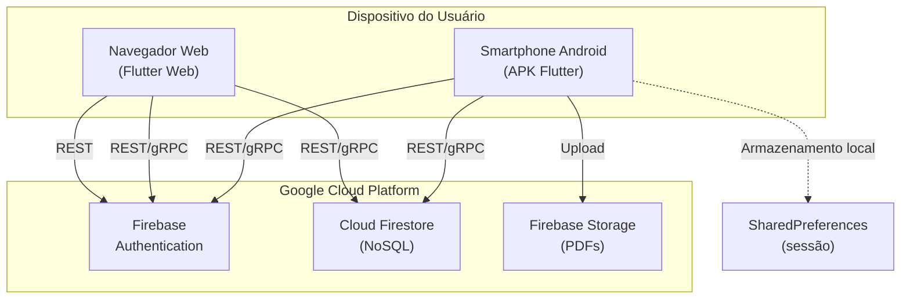

---

## 7. Diagramas de Estado

### 7.1 Ciclo de Vida do Usuário

Usuários são criados pela plataforma administrativa e transitam entre os
estados ativo e inativo por decisão do administrador.

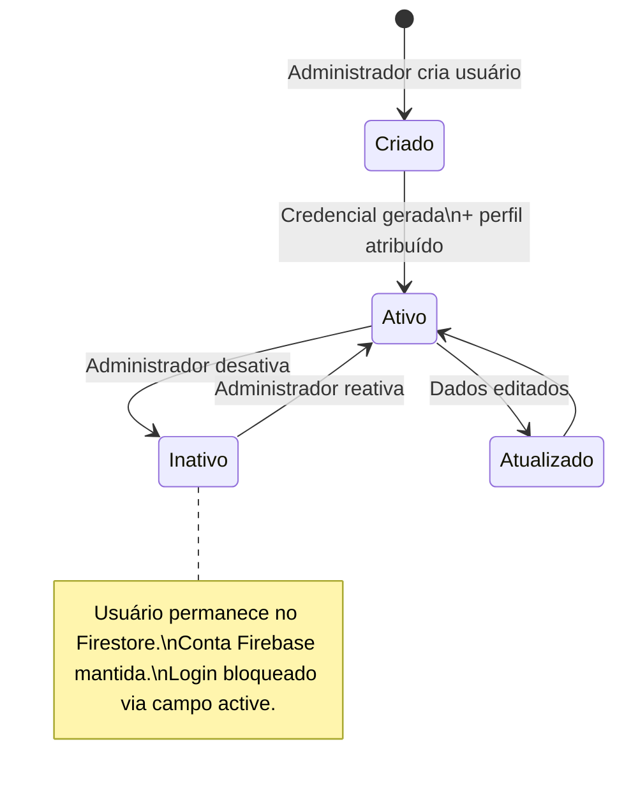

### 7.2 Upload Flow (Máquina de Estados)

O fluxo de importação e extração no aplicativo móvel é governado por uma
máquina de estados com nove passos, implementada no módulo `UploadFlow`.

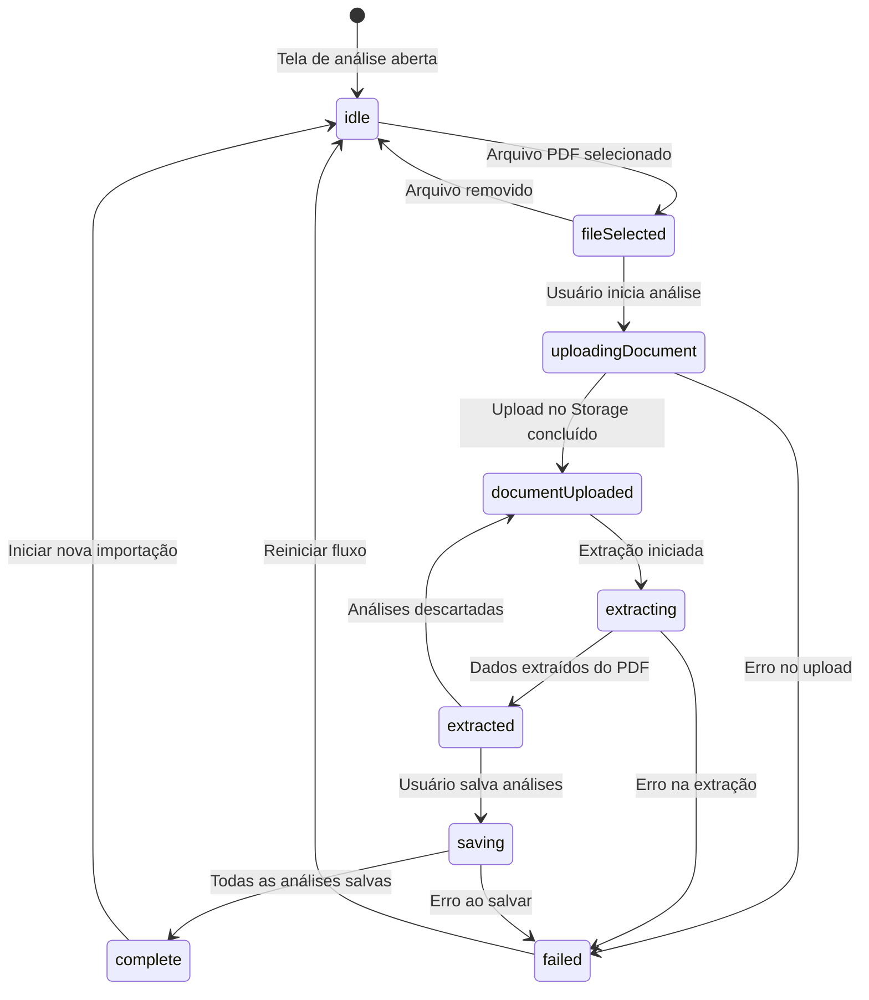

---

## 8. Workflow TO BE (Fluxo Digital)

O fluxo proposto substitui a transcrição manual por um processo digital
integrado com Firebase.

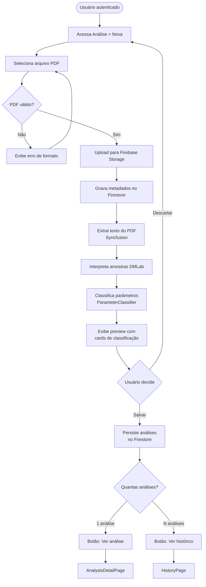

---

## 9. Visualização dos Parâmetros (Atualizado)

A tela de detalhe da análise **não utiliza mais gráfico de barras com
FL Chart**. Desde a refatoração de maio/2026, a visualização é composta por:

- **Resumo**: contagem de parâmetros classificados (Baixo, Médio, Alto).
- **Faixas dos parâmetros**: barras horizontais por parâmetro, cada uma
  usando a própria faixa de referência, com marcador posicionado no valor
  medido.
- **Detalhamento**: cards agrupados por nível de classificação, com valor,
  unidade, faixa de referência e indicação Baixo/Médio/Alto.

A classificação é feita pelo módulo compartilhado `ParameterClassifier`
do pacote `anasoil_shared`, consumido por ambas as aplicações.

A dependência `fl_chart` permanece no `pubspec.yaml` mas não é mais
utilizada na página de detalhe da análise. Caso nenhuma outra tela a
referencie, pode ser removida em limpeza futura.
