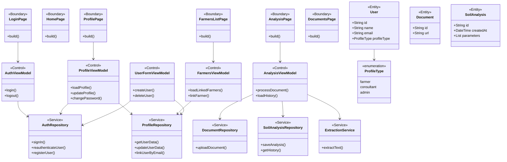
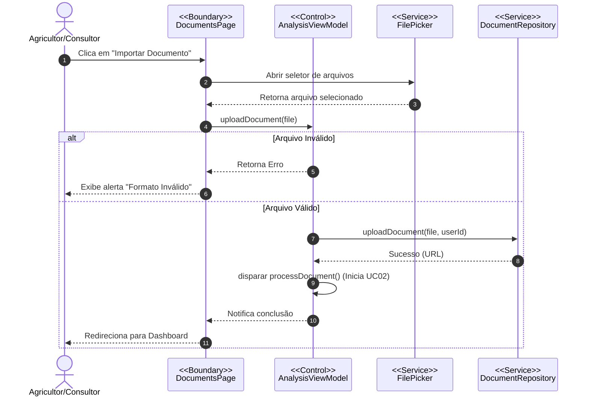
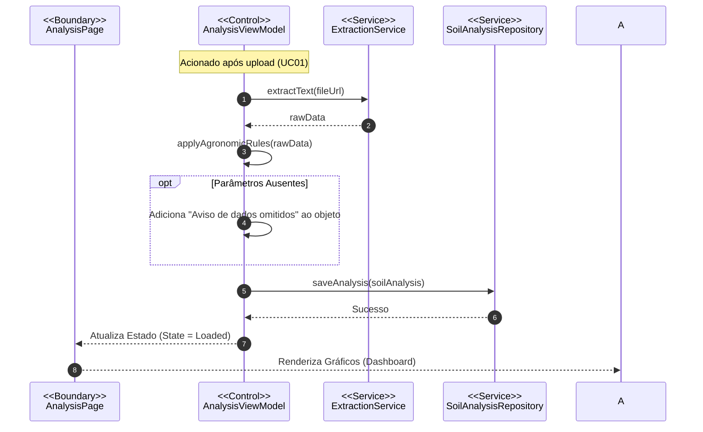
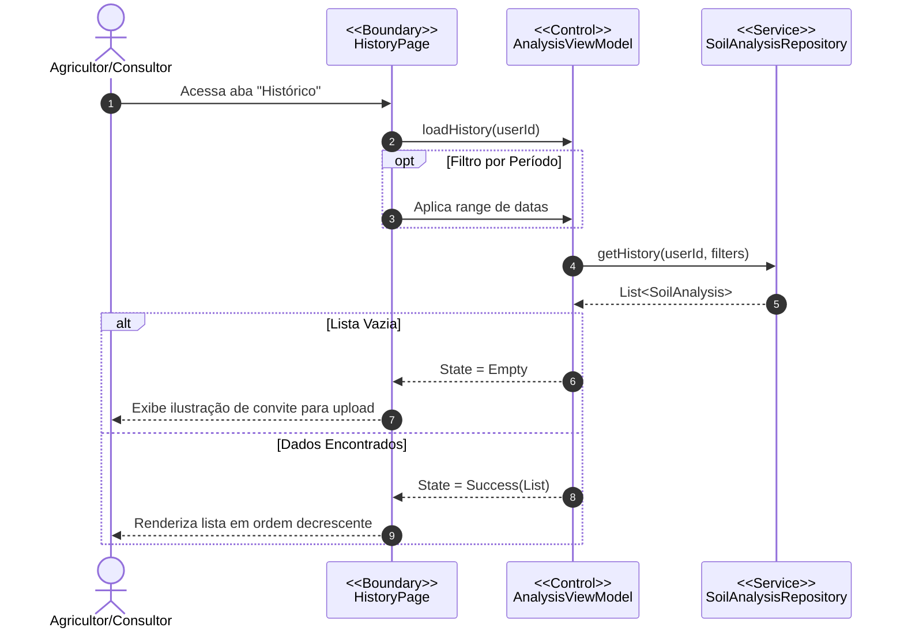
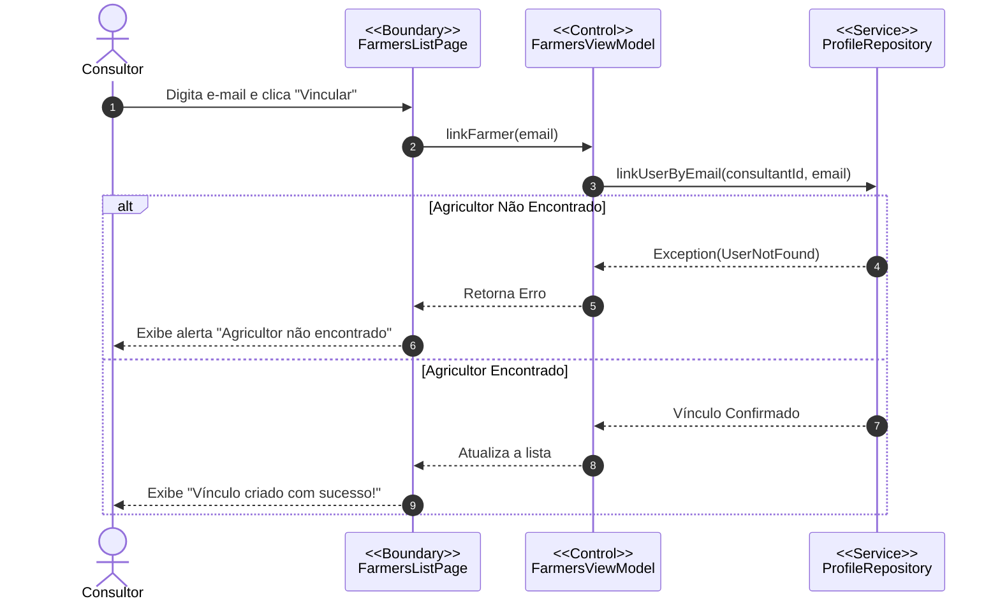
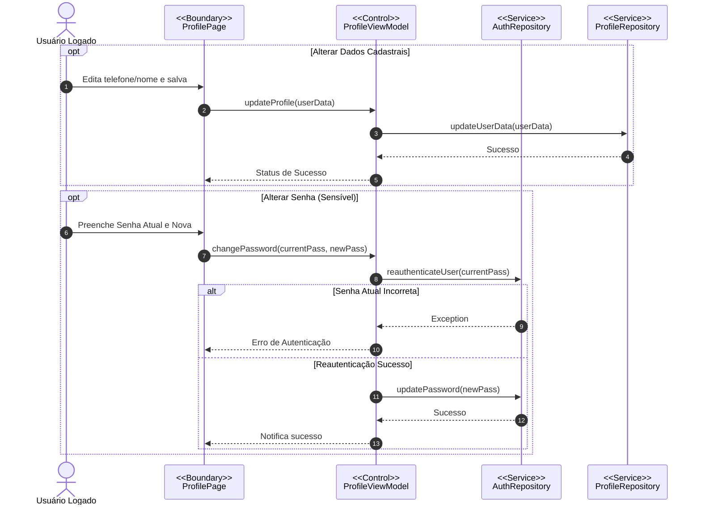
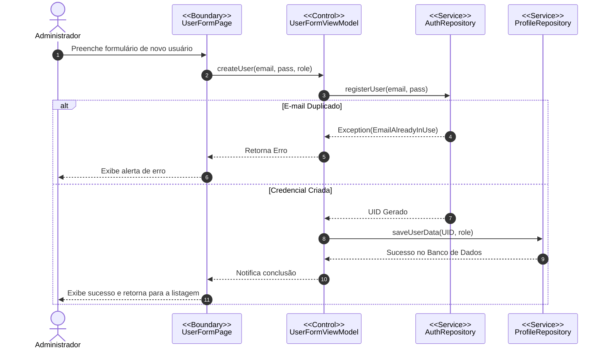

# Documentação Técnica: Projeto AnaSoil

Este documento descreve a arquitetura e os fluxos de comportamento do sistema **AnaSoil**, utilizando a notação UML via Mermaid.js. A documentação segue as diretrizes do **RUP (Rational Unified Process)** e adota o padrão de design **EBC (Entity-Boundary-Control)**.

---

## 1. Diagrama de Classes (Modelo de Projeto)

Este diagrama representa a estrutura estática do sistema, dividida em camadas de Fronteira (Boundary), Controle (Control) e Entidade (Entity), além dos serviços de integração. O modelo reflete a implementação **RBAC (Role-Based Access Control)** conforme o código-fonte desenvolvido em Flutter.

2. Diagramas de Sequência (Casos de Uso)

Os diagramas abaixo ilustram a troca de mensagens entre os objetos do sistema durante a execução de cada funcionalidade chave, demonstrando a interação entre a Interface (Boundary), a Regra de Negócio (Control) e a Persistência de Dados (Services/Repository).

UC01: Importar Documento

UC02: Gerar Análise

UC03: Consultar Histórico

UC04: Gerenciar Agricultores

UC05: Gerenciar Perfil

UC06: Gerenciar Usuários (Administrador)

